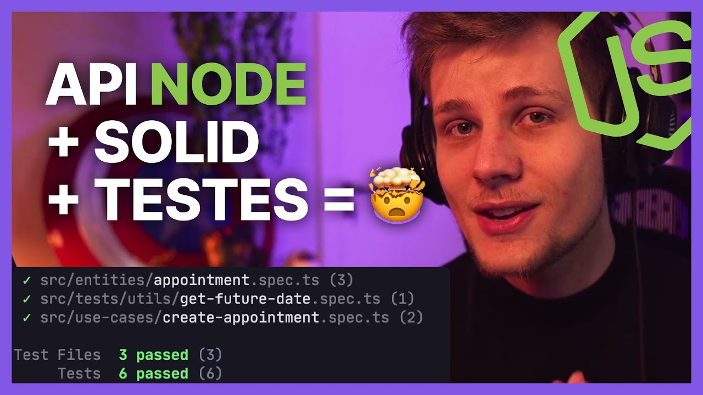

# Testes Node.js + Vitest

> Aplicação para testar integração do [Node.js](https://nodejs.org/) e [Vitest](https://vitest.dev/).

Video Youtube: [Seu próximo back-end Node com TESTES! (+ SOLID)](https://www.youtube.com/watch?v=jBOLRzjEERk)

## Como rodar os Testes

```
npm run test
```

---

### Testes entities

**`appoinement.spec.ts`**

```ts
import { expect, test } from "vitest";

import { getFutureDate } from "../tests/utils/get-future-date";
import { getPastDate } from "../tests/utils/get-past-date";
import { Appointment } from "./appointment";

const makeAppointmentProps = () => {
  const startsAt = getFutureDate("2022-10-10");
  const endsAt = getFutureDate("2022-10-11");

  const appointmentProps = {
    customer: "John Doe",
    startsAt,
    endsAt,
  };

  return { appointmentProps };
};

test("create an appointment", () => {
  const { appointmentProps } = makeAppointmentProps();

  const appointment = new Appointment(appointmentProps);

  expect(appointment).toBeInstanceOf(Appointment);
  expect(appointment.customer).toEqual("John Doe");
});

test("cannot create an appointment with end date before start date", () => {
  const { appointmentProps } = makeAppointmentProps();
  appointmentProps.endsAt.setDate(appointmentProps.startsAt.getDate() - 1);

  expect(() => {
    return new Appointment(appointmentProps);
  }).toThrow();
});

test("cannot create an appointment with start date before now", () => {
  const { appointmentProps } = makeAppointmentProps();
  appointmentProps.startsAt = getPastDate("2022-05-05");

  expect(() => {
    return new Appointment(appointmentProps);
  }).toThrow();
});
```

---

### Testes usecases

**`create-appoinement.spec.ts`**

```ts
import { describe, expect, it } from "vitest";

import { Appointment } from "../entities/appointment";
import { getFutureDate } from "../tests/utils/get-future-date";
import { InMemoryAppointmentsRepository } from "./../repositories/in-memory/in-memory-appointment-repository";
import { CreateAppointmentUseCase } from "./create-appointment";

const makeCreateAppointmentRequest = () => {
  const startsAt = getFutureDate("2022-10-10");
  const endsAt = getFutureDate("2022-10-11");

  const createAppointmentRequest = {
    customer: "John Doe",
    startsAt,
    endsAt,
  };

  return createAppointmentRequest;
};

const makeSut = () => {
  const inMemoryAppointmentsRepository = new InMemoryAppointmentsRepository();
  const createAppointmentUseCase = new CreateAppointmentUseCase(
    inMemoryAppointmentsRepository,
  );
  return { createAppointmentUseCase, inMemoryAppointmentsRepository };
};

describe("Create Appointment Use Case", () => {
  it("should be able to create an Appointment", async () => {
    const { createAppointmentUseCase } = makeSut();
    const createAppointmentRequest = makeCreateAppointmentRequest();

    await expect(
      createAppointmentUseCase.execute(createAppointmentRequest),
    ).resolves.toBeInstanceOf(Appointment);
  });

  it("should not be able to create an Appointment with overlapping dates", async () => {
    const { createAppointmentUseCase } = makeSut();
    const customer = "John Doe";
    const startsAt = getFutureDate("2022-10-10");
    const endsAt = getFutureDate("2022-10-15");

    await createAppointmentUseCase.execute({
      customer,
      startsAt,
      endsAt,
    });

    await expect(
      createAppointmentUseCase.execute({
        customer,
        startsAt: getFutureDate("2022-10-14"),
        endsAt: getFutureDate("2022-10-18"),
      }),
    ).rejects.toBeInstanceOf(Error);

    await expect(
      createAppointmentUseCase.execute({
        customer,
        startsAt: getFutureDate("2022-10-08"),
        endsAt: getFutureDate("2022-10-14"),
      }),
    ).rejects.toBeInstanceOf(Error);

    await expect(
      createAppointmentUseCase.execute({
        customer,
        startsAt: getFutureDate("2022-10-12"),
        endsAt: getFutureDate("2022-10-14"),
      }),
    ).rejects.toBeInstanceOf(Error);

    await expect(
      createAppointmentUseCase.execute({
        customer,
        startsAt: getFutureDate("2022-10-05"),
        endsAt: getFutureDate("2022-10-20"),
      }),
    ).rejects.toBeInstanceOf(Error);
  });
});
```
